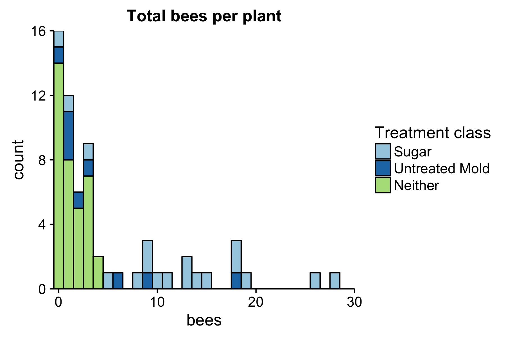
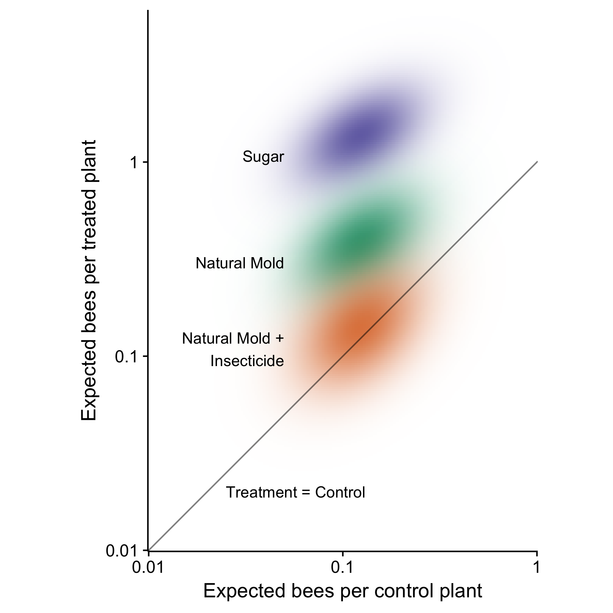

# Appendix for 'Bees Without Flowers'

# Preliminaries


```r
set.seed(1)
library(lme4)      # For model fitting
library(tidyverse) # For data processing
library(mvtnorm)   # for multivariate Gaussians

# hours_noon represents the amount of time since noon (or until noon, if
# the value is negative)
d = read.csv("Meiners_BeeHoneydew_data.csv") %>% 
  mutate(hours_noon = min_day / 60 - 12) %>% 
  mutate(treatment_class = 1 + Sugar + 2 * Mold -2 * (Mold * Insecticide)) %>% 
  mutate(treatment_class = factor(treatment_class, 
                                  labels = c("Neither", "Sugar", "Untreated Mold"))) %>% 
  mutate(treatment_class = forcats::fct_relevel(treatment_class,
                                                c("Sugar", "Untreated Mold")))


d %>% 
  group_by(Plant_Code, treatment_class) %>% 
  summarize(bees = sum(Bee_Count)) %>% 
  ggplot(aes(x = bees, fill = treatment_class)) + 
  geom_histogram(binwidth = 1, color = "black") + 
  cowplot::theme_cowplot() + 
  scale_fill_brewer(type = "qual", palette = 3) + 
  coord_cartesian(expand = FALSE, xlim = c(-.5, 30)) + 
  ggtitle("Total bees per plant")
```

<!-- -->

```r
d %>% 
  group_by(Plant_Code, treatment_class) %>% 
  summarize(bees = sum(Bee_Count)) %>% 
  group_by(treatment_class) %>% 
  summarize(mean(bees))
```

```
## # A tibble: 3 × 2
##   treatment_class `mean(bees)`
##            <fctr>        <dbl>
## 1           Sugar    12.222222
## 2  Untreated Mold     4.555556
## 3         Neither     1.305556
```

# Core model formulas

We will be focusing on models that include fixed effect for the experimental 
manipulations and for site, as well as a continuous time-of-day variable to 
capture variation in bee activity associated with diurnal patterns.
We modeled variation among days (e.g. due to differences in recent weather 
events) and among individual plants using random effects. Because the number
of sites (3) was too small to estimate site-to-site variance, we treated `Site` 
as a fixed effect.

While additional variables were recorded during sampling, their primary purpose
was to keep the sampling effort focused on a narrow range of environmental 
conditions (because environmental effects such as humidity were not related to
our primary hypotheses). We thus did not expect these variables to vary enough
in our samples to substantially affect the results, and did not include them
in most of our analyses. In the final section of this Appendix, we show that
the exclusion of these variables (and of a continuous measure of seasonality) 
do not affect the statistical significance or point estimates associated with
any treatment effects, and that they do not significantly improve model fit in 
terms of $\chi^2$ or AIC.


```r
raw_formula = "Bee_Count ~ Mold * Insecticide + 
                           Sugar * Paint + 
                           hours_noon + 
                           Site +
                           (1|Plant_Code) + 
                           (1|julDate)"

formula = as.formula(raw_formula)
```

We also fit a model that did not include sugar as a predictor variable, to 
assess whether its inclusion substantially improves our ability to predict bee
density. 


```r
# Drop "Sugar" and the asterisk from the formula
no_sugar_formula = as.formula(
  gsub("Sugar \\* ", "", raw_formula)
)

print(no_sugar_formula)
```

```
## Bee_Count ~ Mold * Insecticide + Paint + hours_noon + Site + 
##     (1 | Plant_Code) + (1 | julDate)
```

# Model fitting

We modeled the bee counts with negative binomial and Poisson mixed models with
the default log link.


```r
# Some versions of the model only reach the maximum-likelihood
# estimate without warnings when we use this optimizer
control = glmerControl(optimizer = "bobyqa")

Honeydew <- glmer.nb(
  formula,
  data=d,
  control = control
)


Honeydew_poisson <- glmer(
  formula,
  data=d,
  family = poisson,
  control = control
)

Honeydew_no_sugar <- glmer.nb(
  no_sugar_formula,
  data=d,
  control = control
)
```

# Model comparison

Which elements of the models fit above are essential? See what happens to model
performance (AIC) when various degrees of freedom are removed from the 
full `Honeydew` negative binomial model.


```r
# Drop predictors from the model & reformat the output for
# subsequent work (e.g. removing headings, renaming columns).
# When `drop` says the number of degrees of freedom is NA, it actually 
# means zero, so replace the NAs.
# If the model in `x` is already simplified, then report a larger
# reduction in degrees-of-freedom.
make_dropped_df = function(x, distribution, n_fewer_df = 0){
  drop1(x) %>% 
    structure(heading = NULL) %>% 
    rownames_to_column(var = "dropped") %>% 
    cbind(distribution = distribution) %>% 
    mutate(Df = ifelse(is.na(Df), 0, Df)) %>% 
    mutate(Df = Df + n_fewer_df) %>% 
    rename_(`df reduction` = "Df")
}

# Use the above function on both of the full models, then manually add
# a row for the no_sugar model.
# Finally, eliminate "<" and ">" to prevent formatting errors
initial_dropped_df = rbind(make_dropped_df(Honeydew, "Negative Binomial", 0), 
                           make_dropped_df(Honeydew_poisson, "Poisson", 1)) %>% 
  rbind(data_frame(dropped = "Sugar", `df reduction` = 2, 
                   AIC = AIC(Honeydew_no_sugar), 
                   distribution = "Negative Binomial")) %>% 
  mutate(dropped = gsub("[\\<\\>]", "", dropped))
```

Omitting site or either of the interaction terms (lines 1, 2, 4 and 5) produces 
a relatively small change in AIC, compared with the full model (line 3). However,
none of the models without overdispersion (i.e. the Poisson-distributed models)
had any appreciable AIC weight, nor did the model that removed all sugar effects 
(line 10).


```r
# Sort, calculate DeltaAIC & AIC weights, format for printing with 
# reasonable precision using knitr's `kable` function for tables.
initial_dropped_df %>% 
  arrange(AIC) %>% 
  mutate(`$\\Delta$AIC` = AIC - AIC[1]) %>% 
  select(-AIC) %>% 
  mutate(`AIC weight (%)` = 100 * exp(-`$\\Delta$AIC` / 2) / 
           sum(exp(-`$\\Delta$AIC` / 2))) %>% 
  cbind(` ` = 1:nrow(.), .) %>% 
  knitr::kable(digits = c(rep(1, 4), 2, 1), align = c("llclrr"))
```

     dropped             df reduction   distribution         $\Delta$AIC   AIC weight (%)
---  -----------------  --------------  ------------------  ------------  ---------------
1    Site                     2         Negative Binomial           0.00             59.4
2    Sugar:Paint              1         Negative Binomial           1.58             26.9
3    none                     0         Negative Binomial           3.57             10.0
4    Mold:Insecticide         1         Negative Binomial           5.68              3.5
5    hours_noon               1         Negative Binomial          11.40              0.2
6    Site                     3         Poisson                    28.16              0.0
7    Sugar:Paint              2         Poisson                    29.97              0.0
8    none                     1         Poisson                    31.94              0.0
9    Mold:Insecticide         2         Poisson                    34.06              0.0
10   Sugar                    2         Negative Binomial          38.69              0.0
11   hours_noon               2         Poisson                    71.34              0.0

$\chi^2$ tests show the same result: omitting sugar effects or overdispersion
significantly reduces model performance (P < .000001).

```r
anova(Honeydew, Honeydew_no_sugar)
```

```
## Data: d
## Models:
## Honeydew_no_sugar: Bee_Count ~ Mold * Insecticide + Paint + hours_noon + Site + 
## Honeydew_no_sugar:     (1 | Plant_Code) + (1 | julDate)
## Honeydew: Bee_Count ~ Mold * Insecticide + Sugar * Paint + hours_noon + 
## Honeydew:     Site + (1 | Plant_Code) + (1 | julDate)
##                   Df    AIC    BIC  logLik deviance Chisq Chi Df
## Honeydew_no_sugar 11 820.74 864.02 -399.37   798.74             
## Honeydew          13 785.62 836.77 -379.81   759.62 39.12      2
##                   Pr(>Chisq)    
## Honeydew_no_sugar               
## Honeydew           3.201e-09 ***
## ---
## Signif. codes:  0 '***' 0.001 '**' 0.01 '*' 0.05 '.' 0.1 ' ' 1
```

```r
anova(Honeydew, Honeydew_poisson)
```

```
## Data: d
## Models:
## Honeydew_poisson: Bee_Count ~ Mold * Insecticide + Sugar * Paint + hours_noon + 
## Honeydew_poisson:     Site + (1 | Plant_Code) + (1 | julDate)
## Honeydew: Bee_Count ~ Mold * Insecticide + Sugar * Paint + hours_noon + 
## Honeydew:     Site + (1 | Plant_Code) + (1 | julDate)
##                  Df    AIC    BIC  logLik deviance  Chisq Chi Df
## Honeydew_poisson 12 813.99 861.21 -395.00   789.99              
## Honeydew         13 785.62 836.77 -379.81   759.62 30.374      1
##                  Pr(>Chisq)    
## Honeydew_poisson               
## Honeydew          3.562e-08 ***
## ---
## Signif. codes:  0 '***' 0.001 '**' 0.01 '*' 0.05 '.' 0.1 ' ' 1
```


# Description of the full `Honeydew` model

```r
summary(Honeydew, correlation = FALSE)
```

```
## Generalized linear mixed model fit by maximum likelihood (Laplace
##   Approximation) [glmerMod]
##  Family: Negative Binomial(1.8463)  ( log )
## Formula: Bee_Count ~ Mold * Insecticide + Sugar * Paint + hours_noon +  
##     Site + (1 | Plant_Code) + (1 | julDate)
##    Data: d
## Control: control
## 
##      AIC      BIC   logLik deviance df.resid 
##    785.6    836.8   -379.8    759.6      365 
## 
## Scaled residuals: 
##     Min      1Q  Median      3Q     Max 
## -1.0060 -0.5083 -0.3610  0.1850  4.6619 
## 
## Random effects:
##  Groups     Name        Variance Std.Dev.
##  Plant_Code (Intercept) 0.3982   0.6311  
##  julDate    (Intercept) 0.1712   0.4138  
## Number of obs: 378, groups:  Plant_Code, 63; julDate, 9
## 
## Fixed effects:
##                  Estimate Std. Error z value Pr(>|z|)    
## (Intercept)      -2.09367    0.50337  -4.159 3.19e-05 ***
## Mold              1.15201    0.49708   2.318  0.02047 *  
## Insecticide       0.45650    0.52686   0.866  0.38624    
## Sugar             2.41458    0.47326   5.102 3.36e-07 ***
## Paint            -0.46287    0.60338  -0.767  0.44300    
## hours_noon        0.16880    0.05426   3.111  0.00186 ** 
## SiteB             0.28098    0.45612   0.616  0.53788    
## SiteC             0.04974    0.46442   0.107  0.91471    
## Mold:Insecticide -1.48408    0.71781  -2.068  0.03869 *  
## Sugar:Paint       0.08231    0.70727   0.116  0.90735    
## ---
## Signif. codes:  0 '***' 0.001 '**' 0.01 '*' 0.05 '.' 0.1 ' ' 1
```

```r
anova(Honeydew)
```

```
## Analysis of Variance Table
##                  Df Sum Sq Mean Sq F value
## Mold              1  5.002   5.002  5.0019
## Insecticide       1 12.643  12.643 12.6429
## Sugar             1 39.648  39.648 39.6479
## Paint             1  2.841   2.841  2.8408
## hours_noon        1 10.158  10.158 10.1582
## Site              2  0.414   0.207  0.2069
## Mold:Insecticide  1  4.880   4.880  4.8797
## Sugar:Paint       1  0.013   0.013  0.0133
```

# Monte Carlo comparison of treatment effects


```r
# Indicator for, "was experimental manipulation i applied to treatment j?""
Mold =        c(1, 1, 0, 0, 0, 0, 0)
Insecticide = c(0, 1, 0, 1, 0, 0, 0)
Sugar =       c(0, 0, 0, 0, 0, 1, 1)
Paint =       c(0, 0, 0, 0, 1, 0, 1)

treat_names = c("Natural Mold", "Natural Mold + Insecticide", "Control", 
                "Insecticide", "Black Paint", "Sugar", "Sugar + Black Paint")

# Ask the model about expected visitation rates under the
# following conditions:
#   * Treatments as specified above
#   * Time of day is noon
#   * Site A (i.e. SiteB's effect and SiteC's effect are 0)
#   * "Typical" plant and "typical" date (random effects set to 0)
newdata = cbind(
  `(Intercept)` = 1,
  Mold = Mold,
  Insecticide = Insecticide,
  Sugar = Sugar,
  Paint = Paint,
  hours_noon = 0,
  SiteB = 0,
  SiteC = 0,
  `Mold:Insecticide` = Mold * Insecticide,
  `Sugar:Paint` = Sugar * Paint
)
row.names(newdata) = treat_names
newdata
```

```
##                            (Intercept) Mold Insecticide Sugar Paint
## Natural Mold                         1    1           0     0     0
## Natural Mold + Insecticide           1    1           1     0     0
## Control                              1    0           0     0     0
## Insecticide                          1    0           1     0     0
## Black Paint                          1    0           0     0     1
## Sugar                                1    0           0     1     0
## Sugar + Black Paint                  1    0           0     1     1
##                            hours_noon SiteB SiteC Mold:Insecticide
## Natural Mold                        0     0     0                0
## Natural Mold + Insecticide          0     0     0                1
## Control                             0     0     0                0
## Insecticide                         0     0     0                0
## Black Paint                         0     0     0                0
## Sugar                               0     0     0                0
## Sugar + Black Paint                 0     0     0                0
##                            Sugar:Paint
## Natural Mold                         0
## Natural Mold + Insecticide           0
## Control                              0
## Insecticide                          0
## Black Paint                          0
## Sugar                                0
## Sugar + Black Paint                  1
```

```r
# mean and variance from lme4's Laplace approximation
parameter_mu = fixef(Honeydew)
parameter_sigma = as.matrix(vcov(Honeydew))

# Generate Monte Carlo samples from lme4's approximate likelihood surface
posterior_samples = rmvnorm(1E6, parameter_mu, parameter_sigma) %*%
  t(newdata)

mu = colMeans(posterior_samples)

# Density of bivariate normal between Control and a named treatment
bivariate_normal_control_density = function(x, name){
  names = c("Control", name)
  dmvnorm(x, 
          mu[names], 
          cov(posterior_samples)[names, names])
}

label_df = data.frame(
  x = c(rep(log(.05), 3)),
  y = c(mu[c("Sugar", "Natural Mold", "Natural Mold + Insecticide")] - 0.25),
  label = c("Sugar", "Natural Mold", "Natural Mold +\nInsecticide")
)
line_df = data.frame(x = log(.025), y = log(.02), 
                     label = "Treatment = Control")

# for each set of x and y values, calculate bivariate densities,
# then tidy up the results for ggplot (with an optional `theme` for
# improved visual display)
plot_data = expand.grid(x = seq(log(.01), log(1), length = 250), 
            y = seq(log(.01), log(6), length = 250)) %>% 
  mutate(Sugar = bivariate_normal_control_density(., "Sugar"),
         `Natural Mold` = bivariate_normal_control_density(., "Natural Mold"),
         `Natural Mold + Insecticide` = 
           bivariate_normal_control_density(., "Natural Mold + Insecticide")) %>% 
  gather(key = treatment, value = likelihood, Sugar, 
         `Natural Mold`, `Natural Mold + Insecticide`) %>% 
  mutate(scaled_likelihood = likelihood / max(likelihood))

plot_data %>% 
  ggplot(aes(x = x, y = y, alpha = scaled_likelihood, 
             fill = treatment)) + 
  geom_tile() +
  scale_alpha_continuous(range = c(0, 1), guide = FALSE) + 
  geom_abline(intercept = 0, slope = 1, color = alpha("black", .5)) +
  cowplot::theme_cowplot() +
  scale_fill_brewer(palette = "Dark2", guide = FALSE) + 
  xlab("Expected bees per control plant") +
  ylab("Expected bees per treated plant") + 
  coord_equal() +
  scale_x_continuous(breaks = log(10^seq(-10, 10)), labels = 10^seq(-10, 10),
                     expand = c(0, 0)) +
  scale_y_continuous(breaks = log(10^seq(-10, 10)), labels = 10^seq(-10, 10),
                     expand = c(0, 0)) +
  geom_text(data = label_df, aes(x = x, y = y, label = label),
            inherit.aes = FALSE, hjust = "right") + 
  geom_text(data = line_df, aes(x = x, y = y, label = label), 
            inherit.aes = FALSE, hjust = "left")
```

<!-- -->

# Post-hoc comparisons among treatment pairs


```r
names = names(sort(colMeans(posterior_samples), decreasing = TRUE))
grid = combn(names, 2) %>% t() %>% as.data.frame(stringsAsFactors = FALSE)
grid$lower = NA
grid$mean = NA
grid$upper = NA
grid$P = NA
for (i in 1:nrow(grid)) {
  # One-sided P-values
  p = mean(posterior_samples[ , grid[[1]][i]] > posterior_samples[ , grid[[2]][i]])
  ratios = exp(posterior_samples[ , grid[[1]][i]] - posterior_samples[ , grid[[2]][i]])
  # Two-sided P-values based on Monte Carlo samples
  grid$P[i] = 1 - 2 * abs(0.5 - p)
  grid$lower[i] = quantile(ratios, .025)
  grid$mean[i] = mean(ratios)
  grid$upper[i] = quantile(ratios, .975)

}

my_format = function(x, d){format(x, digits = d, trim = TRUE)}
table = grid %>% 
  mutate(`False Discovery Rate` = p.adjust(P, method = "fdr")) %>% 
  cbind(ratio = paste0(my_format(.$mean, 3), 
                               " (", 
                               my_format(.$lower, 2), 
                               "-", 
                               my_format(.$upper, 3), 
                               ")")) %>% 
  select(V1, V2, ratio, P, `False Discovery Rate`)
```

Significance and False Discovery Rates for selected post-hoc comparisons between
treatments. The false discovery rate is a way to correct for multiple comparisons
without sacrificing too much statistical power. See `?p.adjust` and references
therein. The treatment with the larger expected visitation rate is listed
in the left column of each row.


```r
table_subset = table %>% 
  filter(
    (V1 == "Sugar" & V2 == "Control") |
      (V1 == "Sugar" & V2 == "Natural Mold") |
      (V1 == "Natural Mold" & V2 == "Control") |
      (V1 == "Natural Mold" &  V2 == "Natural Mold + Insecticide") |
      (V1 == "Natural Mold + Insecticide" &  V2 == "Control") | 
      (V1 == "Insecticide" &  V2 == "Control") | 
      (V1 == "Sugar" & V2 == "Sugar + Black Paint")
  )
table_subset %>% 
  knitr::kable(digits = 2)
```


V1                           V2                           ratio                    P   False Discovery Rate
---------------------------  ---------------------------  -------------------  -----  ---------------------
Sugar                        Sugar + Black Paint          1.57 (0.71-3.02)      0.30                   0.40
Sugar                        Natural Mold                 3.83 (1.61-7.76)      0.00                   0.00
Sugar                        Control                      12.51 (4.43-28.26)    0.00                   0.00
Natural Mold                 Natural Mold + Insecticide   3.15 (1.07-7.26)      0.04                   0.06
Natural Mold                 Control                      3.58 (1.20-8.39)      0.02                   0.04
Insecticide                  Control                      1.81 (0.56-4.44)      0.39                   0.45
Natural Mold + Insecticide   Control                      1.32 (0.39-3.31)      0.82                   0.82


Significance and False Discovery Rates for all pairwise comparisons among
experimental treatments.


```r
table %>% 
  knitr::kable(digits = 2)
```


V1                           V2                           ratio                    P   False Discovery Rate
---------------------------  ---------------------------  -------------------  -----  ---------------------
Sugar                        Sugar + Black Paint          1.57 (0.71-3.02)      0.30                   0.40
Sugar                        Natural Mold                 3.83 (1.61-7.76)      0.00                   0.00
Sugar                        Insecticide                  7.79 (3.01-16.64)     0.00                   0.00
Sugar                        Natural Mold + Insecticide   10.98 (3.99-24.40)    0.00                   0.00
Sugar                        Control                      12.51 (4.43-28.26)    0.00                   0.00
Sugar                        Black Paint                  20.44 (6.32-50.04)    0.00                   0.00
Sugar + Black Paint          Natural Mold                 2.62 (1.09-5.33)      0.03                   0.05
Sugar + Black Paint          Insecticide                  5.34 (2.04-11.49)     0.00                   0.00
Sugar + Black Paint          Natural Mold + Insecticide   7.52 (2.71-16.81)     0.00                   0.00
Sugar + Black Paint          Control                      8.56 (3.01-19.50)     0.00                   0.00
Sugar + Black Paint          Black Paint                  13.99 (4.31-34.39)    0.00                   0.00
Natural Mold                 Insecticide                  2.23 (0.81-4.97)      0.13                   0.19
Natural Mold                 Natural Mold + Insecticide   3.15 (1.07-7.26)      0.04                   0.06
Natural Mold                 Control                      3.58 (1.20-8.39)      0.02                   0.04
Natural Mold                 Black Paint                  5.85 (1.72-14.76)     0.00                   0.01
Insecticide                  Natural Mold + Insecticide   1.59 (0.51-3.84)      0.52                   0.55
Insecticide                  Control                      1.81 (0.56-4.44)      0.39                   0.45
Insecticide                  Black Paint                  2.96 (0.81-7.75)      0.11                   0.17
Natural Mold + Insecticide   Control                      1.32 (0.39-3.31)      0.82                   0.82
Natural Mold + Insecticide   Black Paint                  2.15 (0.56-5.79)      0.32                   0.40
Control                      Black Paint                  1.91 (0.49-5.18)      0.44                   0.49


# Comparing to a model with environmental predictors & continuous dates

We could have obtained essentially the same results with a much larger model that 
included a fixed effect for date and environmental conditions (i.e., there would
still be a significant sugar effect with point estimate $\approx$ 2.4, 
a significant mold effect with point estimate $\approx$ 1.2, and a significant 
mold/insecticide interaction with point estimate $\approx$ -1.5). 

However, the eight degrees of freedom associated with environmental conditions
and the fixed effect for date do not improve the model fit enough to 
justify the additional complexity ($\chi^2$ > 0.25, higher AIC), so we disregard
them outide of this section.


```r
# rescaling variables that have large values using `scale` improves numerical 
# accuracy, but will not affect AIC.
Honeydew_env = glmer.nb(Bee_Count ~ Mold * Insecticide + 
                          Sugar * Paint + 
                          Site + 
                          hours_noon + 
                          scale(Temp_F) + 
                          scale(Wind_mph) + 
                          Conditions + 
                          scale(Barometric) +
                          scale(Humidity) + 
                          scale(julDate) +
                          (1|Plant_Code) + 
                          (1|julDate), 
                        data = d, 
                        control = control)
print(summary(Honeydew_env), correlation = FALSE)
```

```
## Generalized linear mixed model fit by maximum likelihood (Laplace
##   Approximation) [glmerMod]
##  Family: Negative Binomial(2.1074)  ( log )
## Formula: 
## Bee_Count ~ Mold * Insecticide + Sugar * Paint + Site + hours_noon +  
##     scale(Temp_F) + scale(Wind_mph) + Conditions + scale(Barometric) +  
##     scale(Humidity) + scale(julDate) + (1 | Plant_Code) + (1 |  
##     julDate)
##    Data: d
## Control: control
## 
##      AIC      BIC   logLik deviance df.resid 
##    791.7    874.3   -374.9    749.7      357 
## 
## Scaled residuals: 
##     Min      1Q  Median      3Q     Max 
## -1.0095 -0.5238 -0.3413  0.1952  4.7630 
## 
## Random effects:
##  Groups     Name        Variance Std.Dev.
##  Plant_Code (Intercept) 0.4284   0.6545  
##  julDate    (Intercept) 0.1009   0.3176  
## Number of obs: 378, groups:  Plant_Code, 63; julDate, 9
## 
## Fixed effects:
##                                        Estimate Std. Error z value
## (Intercept)                            -1.95538    0.72181  -2.709
## Mold                                    1.17430    0.50503   2.325
## Insecticide                             0.42923    0.53530   0.802
## Sugar                                   2.39457    0.47918   4.997
## Paint                                  -0.61127    0.61237  -0.998
## SiteB                                   0.73398    0.57844   1.269
## SiteC                                   0.50101    0.53278   0.940
## hours_noon                              0.01093    0.09681   0.113
## scale(Temp_F)                           0.22330    0.18097   1.234
## scale(Wind_mph)                         0.19258    0.12820   1.502
## ConditionsCompletly Cloudy (no Shadow)  0.39652    0.55278   0.717
## ConditionsFull Sun                     -0.65723    0.55215  -1.190
## ConditionsPartly Cloudy (>50% sun)      0.23767    0.44193   0.538
## scale(Barometric)                      -0.34483    0.17986  -1.917
## scale(Humidity)                        -0.03533    0.19502  -0.181
## scale(julDate)                         -0.13315    0.16300  -0.817
## Mold:Insecticide                       -1.47040    0.73224  -2.008
## Sugar:Paint                             0.29472    0.71953   0.410
##                                        Pr(>|z|)    
## (Intercept)                             0.00675 ** 
## Mold                                    0.02006 *  
## Insecticide                             0.42265    
## Sugar                                  5.82e-07 ***
## Paint                                   0.31818    
## SiteB                                   0.20448    
## SiteC                                   0.34703    
## hours_noon                              0.91013    
## scale(Temp_F)                           0.21724    
## scale(Wind_mph)                         0.13304    
## ConditionsCompletly Cloudy (no Shadow)  0.47318    
## ConditionsFull Sun                      0.23392    
## ConditionsPartly Cloudy (>50% sun)      0.59072    
## scale(Barometric)                       0.05521 .  
## scale(Humidity)                         0.85623    
## scale(julDate)                          0.41398    
## Mold:Insecticide                        0.04463 *  
## Sugar:Paint                             0.68210    
## ---
## Signif. codes:  0 '***' 0.001 '**' 0.01 '*' 0.05 '.' 0.1 ' ' 1
```

```r
anova(Honeydew, Honeydew_env)
```

```
## Data: d
## Models:
## Honeydew: Bee_Count ~ Mold * Insecticide + Sugar * Paint + hours_noon + 
## Honeydew:     Site + (1 | Plant_Code) + (1 | julDate)
## Honeydew_env: Bee_Count ~ Mold * Insecticide + Sugar * Paint + Site + hours_noon + 
## Honeydew_env:     scale(Temp_F) + scale(Wind_mph) + Conditions + scale(Barometric) + 
## Honeydew_env:     scale(Humidity) + scale(julDate) + (1 | Plant_Code) + (1 | 
## Honeydew_env:     julDate)
##              Df    AIC    BIC  logLik deviance Chisq Chi Df Pr(>Chisq)
## Honeydew     13 785.62 836.77 -379.81   759.62                        
## Honeydew_env 21 791.70 874.34 -374.85   749.70 9.915      8      0.271
```
